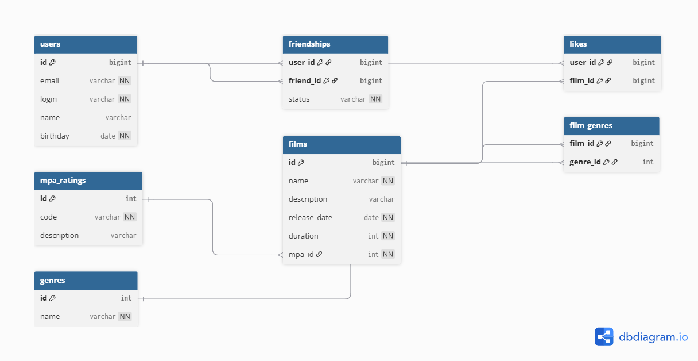

# java-filmorate

Template repository for Filmorate project.

## 📚 Схема базы данных

Схема базы данных расположена в файле:



### Описание структуры

База данных поддерживает бизнес-логику приложения Filmorate.

- Пользователи хранятся в таблице `users`.
- Фильмы — в таблице `films`.
- У фильма может быть несколько жанров — связь реализована через таблицу `film_genres`.
- Рейтинг MPA вынесен в отдельную таблицу `mpa_ratings`.
- Лайки пользователей хранятся в таблице `likes`.
- Дружба пользователей хранится в таблице `friendships` и имеет статус:
    - UNCONFIRMED — заявка отправлена
    - CONFIRMED — заявка подтверждена

Промежуточные таблицы используются для реализации связей many-to-many.

---

## Примеры основных SQL-запросов

### Получить всех пользователей

```sql
SELECT * FROM users;

### Получить фильм вместе с жанрами

SELECT f.*, g.name AS genre_name
FROM films f
LEFT JOIN film_genres fg ON f.id = fg.film_id
LEFT JOIN genres g ON fg.genre_id = g.id
WHERE f.id = 1;

### Получить топ-10 популярных фильмов

SELECT f.*, COUNT(l.user_id) AS likes_count
FROM films f
LEFT JOIN likes l ON f.id = l.film_id
GROUP BY f.id
ORDER BY likes_count DESC
LIMIT 10;

### Добавить заявку в друзья

INSERT INTO friendships (user_id, friend_id, status)
VALUES (1, 2, 'UNCONFIRMED');

### Подтвердить дружбу

UPDATE friendships
SET status = 'CONFIRMED'
WHERE user_id = 1 AND friend_id = 2;

### Получить общих друзей

SELECT u.*
FROM friendships f1
JOIN friendships f2 ON f1.friend_id = f2.friend_id
JOIN users u ON u.id = f1.friend_id
WHERE f1.user_id = 1
  AND f2.user_id = 2
  AND f1.status = 'CONFIRMED'
  AND f2.status = 'CONFIRMED';

